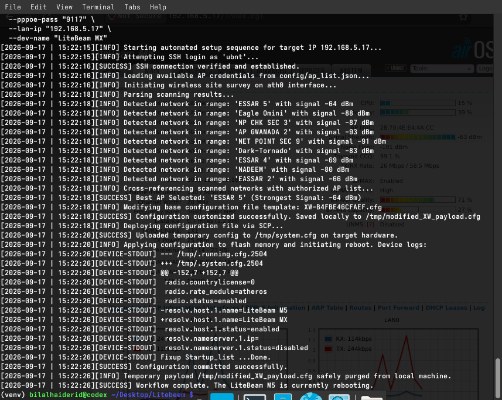
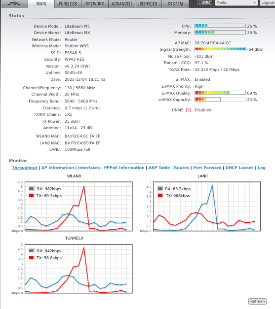

# airOS-AutoProvision (Termux & Linux Edition)




A Python CLI tool for provisioning and managing Ubiquiti LiteBeam M5 devices running airOS in Station mode.

The tool supports Linux and non-rooted Android devices running Termux. It connects to legacy airOS firmware over SSH, performs a live wireless site survey, selects an authorized access point, prepares PPPoE/LAN settings, and writes the resulting configuration to the device's flash memory.

> **Authorization required:** Use this project only with Ubiquiti devices and networks that you own or are explicitly authorized to administer.

## 🚀 Features

- **Termux and non-rooted Android support** — calculates the temporary subnet configuration and guides you through manually assigning a static IP on Android when root access is unavailable.
- **Smart site survey** — runs `iwlist ath0 scan` on the device, matches detected networks against an authorized AP list, and selects the strongest matching signal.
- **Dynamic LAN and DHCP configuration** — accepts a target `--lan-ip` and derives the device network settings and DHCP range.
- **Legacy SSH/SCP compatibility** — uses the system's native `ssh` and `scp` commands with `sshpass`, legacy SCP mode, and `ssh-rsa` compatibility options required by older airOS firmware.
- **PPPoE and credential injection** — updates PPPoE credentials, hostname, wireless settings, and LAN configuration in the generated airOS payload.
- **Flash deployment and restart** — uploads the payload, commits it with `/sbin/cfgmtd`, and restarts the device to apply the configuration.

## 📁 Project Structure

```text
airOS-AutoProvision/
├── config/
│   └── ap_list.json         # Authorized access points and WPA keys
├── screenshot/
│   ├── litebeem.png         # Hardware reference photo
│   └── output.png           # CLI execution screenshot
├── LICENSE                  # Project license
├── README.md                # Project documentation
├── XW-B4FBE46CFAEF.cfg      # Base airOS configuration template
├── main.py                  # CLI entry point
└── requirements.txt         # Python dependencies, if applicable
```

## 🛠️ Prerequisites

The tool relies on native SSH utilities because legacy airOS firmware may not work with current Paramiko or OpenSSH defaults.

### Termux on Android

```bash
pkg update
pkg install openssh sshpass python
```

### Arch Linux

```bash
sudo pacman -S openssh sshpass python
```

### Ubuntu/Debian

```bash
sudo apt update
sudo apt install openssh-client sshpass python3
```

If the project declares Python dependencies, install them with:

```bash
python3 -m venv .venv
source .venv/bin/activate
pip install -r requirements.txt
```

## ⚙️ Configure the Authorized AP List

Create or edit `config/ap_list.json` with the wireless networks the LiteBeam is allowed to use:

```json
[
  {
    "ssid": "Your AP Name",
    "password": "your_wifi_password_here"
  },
  {
    "ssid": "Another AP Name",
    "password": "another_wifi_password_here"
  }
]
```

The script scans nearby networks, filters results against this list, and chooses the strongest authorized match.

### Protect credentials

Do not commit real Wi-Fi passwords, PPPoE credentials, or production configuration files to Git. Use a local configuration file, environment-specific secrets, or a private fork as appropriate for your deployment.

## 💻 Usage

For a factory-reset or new device, the commonly used default connection details are:

- IP address: `192.168.1.20`
- Username: `ubnt`
- Password: `ubnt`

Run the provisioning command with the device's current credentials and desired network settings:

```bash
python3 main.py \
  --device-ip 192.168.1.20 \
  --ssh-user ubnt \
  --ssh-pass ubnt \
  --pppoe-user "your_pppoe_username" \
  --pppoe-pass "your_pppoe_password" \
  --lan-ip "192.168.5.17" \
  --dev-name "LiteBeam M5" \
  --ap-list config/ap_list.json \
  --config XW-B4FBE46CFAEF.cfg
```

> Replace all example credentials and IP addresses with values appropriate for your authorized deployment.

## 📱 Termux Workflow

On a non-rooted Android device, Termux cannot directly change the Wi-Fi interface address. The tool therefore pauses and guides you through the process:

1. The script calculates the temporary IP address required by the phone.
2. Open Android Wi-Fi settings and assign that static IP to the connected Wi-Fi network.
3. Return to Termux and press **Enter** to continue.
4. The tool connects to the LiteBeam, performs the survey, updates the configuration, and flashes it.
5. After provisioning completes, restore the Android Wi-Fi configuration to **DHCP**.

## 🧰 Command-Line Arguments

| Argument | Description | Default |
| --- | --- | --- |
| `--device-ip` | Current IP address of the LiteBeam | `192.168.1.20` |
| `--ssh-user` | Current SSH username | `ubnt` |
| `--ssh-pass` | Current SSH password | `ubnt` |
| `--pppoe-user` | PPPoE username to inject | Required |
| `--pppoe-pass` | PPPoE password to inject | Required |
| `--lan-ip` | Static LAN IP to assign to the device | Required |
| `--dev-name` | New hostname for the device | Required |
| `--ap-list` | Authorized AP list file | `config/ap_list.json` |
| `--config` | Base airOS configuration template | `XW-B4FBE46CFAEF.cfg` |

For the authoritative list of options supported by the current implementation, run:

```bash
python3 main.py --help
```

## 🔍 How It Works

1. Connects to the LiteBeam using SSH and legacy compatibility settings.
2. Runs a wireless scan on `ath0`.
3. Matches discovered SSIDs against `config/ap_list.json`.
4. Selects the strongest authorized access point.
5. Updates the base configuration with wireless, PPPoE, hostname, LAN, and DHCP values.
6. Uploads the generated payload to the device.
7. Commits the configuration to flash using `/sbin/cfgmtd`.
8. Restarts the device so the new settings take effect.

## ⚠️ Safety Notes

- Confirm the target IP and credentials before starting.
- The device may become reachable at its new LAN IP after provisioning.
- A wrong LAN address or subnet can temporarily make the device inaccessible.
- Back up the existing device configuration before applying changes in production.
- Never use this tool to access or reconfigure equipment without permission.
- Keep secrets out of source control and command history where possible.

## 📄 License

See [LICENSE](LICENSE) for the applicable license terms.
